# StayHealthy Medical Appointment Booking Website

## Overview

StayHealthy Inc. is a non-profit organization dedicated to improving healthcare facilities in remote areas. As part of the Go Digital initiative, StayHealthy is building a website to help patients access doctors and specialists easily for consultations and medical prescriptions.

The website will offer a user-friendly platform that allows patients to book medical appointments, view doctor listings, provide consultation feedback, and manage their personal profiles, all through an intuitive and accessible interface.

### Medical Appointments Online
- **Schedule Appointments**: Patients can schedule appointments with doctors, selecting their preferred time slots.
- **Instant Consultation**: Consultation with doctors is available without prior appointments.
- **Appointment Reminders**: Patients will receive reminders for upcoming appointments.
- **Appointment Modifications and Cancellations**: Patients can cancel or modify appointments.

### Doctor Listings for Patients
- **View Available Doctors**: Patients can browse a list of doctors, sorted by specialty and ratings.
- **Doctor Profiles**: Each doctor’s profile will include their ratings, specialties, and reviews.
- **Search Functionality**: Users can search for specific doctors by name or specialty.

### Consultation Feedback
- **Rate Consultations**: After consultations, patients can rate their experience based on effectiveness and communication.
- **Leave Feedback**: Patients can leave reviews and contribute to the transparency of the healthcare system.

### Profile Management
- **Sign-Up/Sign-In**: Users must sign up to make bookings and manage their profiles.
- **Update Profile Information**: Users can update their personal details, medical records, and contact information.

### Access to Patient Records
- **Privacy**: Only the patient and their doctor have access to medical records.
- **Download Test Reports**: Patients can download their medical records, including test reports and prescriptions.

### Educational Resources
- **Health Tips**: Daily health tips and preventive measures.
- **Educational Videos**: Various health topics and resources available for patients to access.

## License

This project is licensed under the License - see the [LICENSE](LICENSE) file for details.

## Contact Information

For any questions or issues, please feel free to contact us:

- Email: info@ongunakay.com

## Features
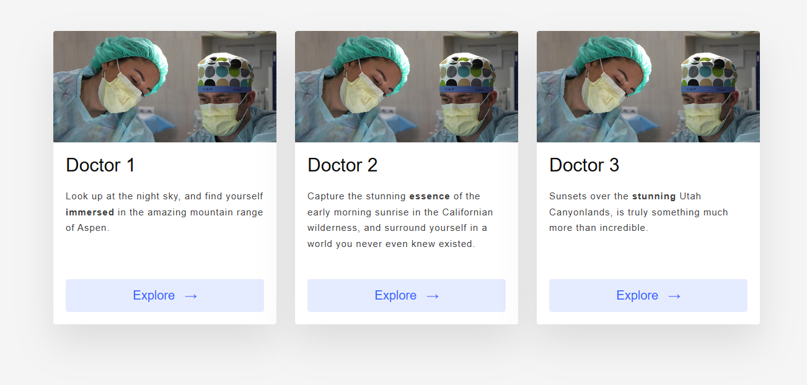 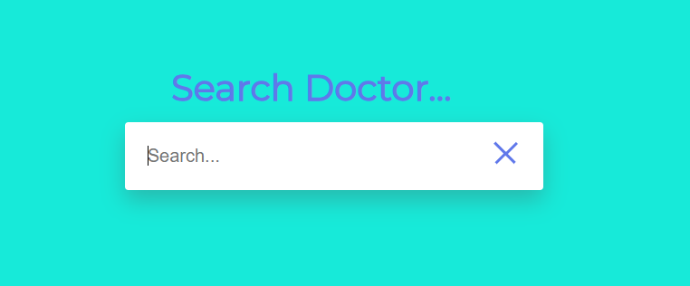  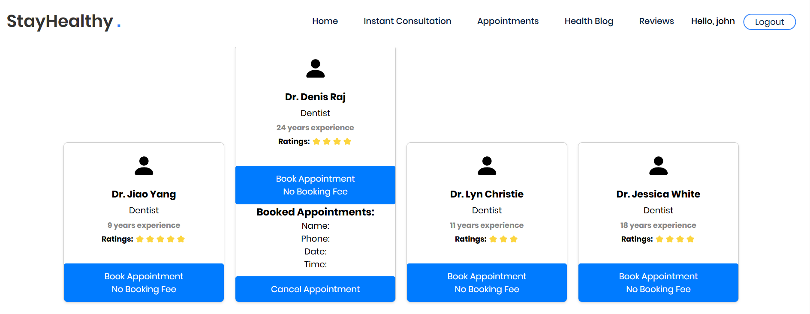 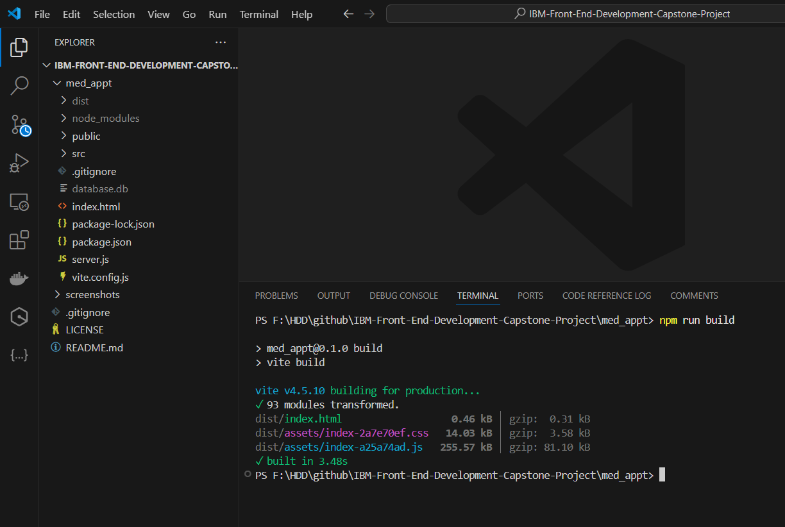    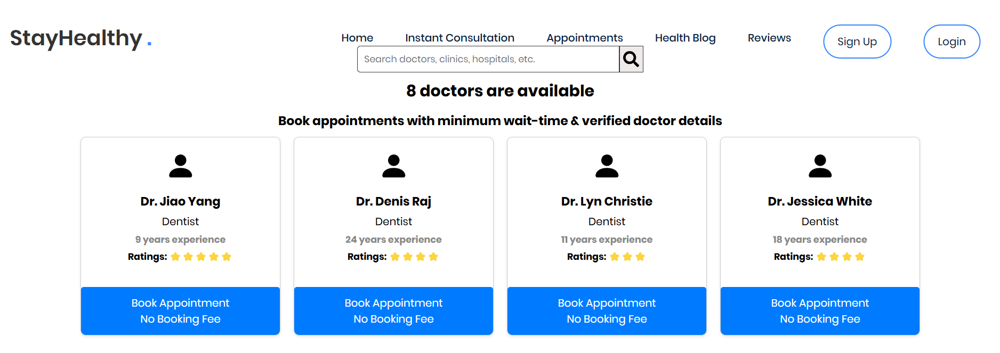 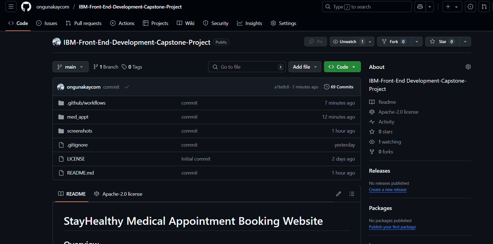 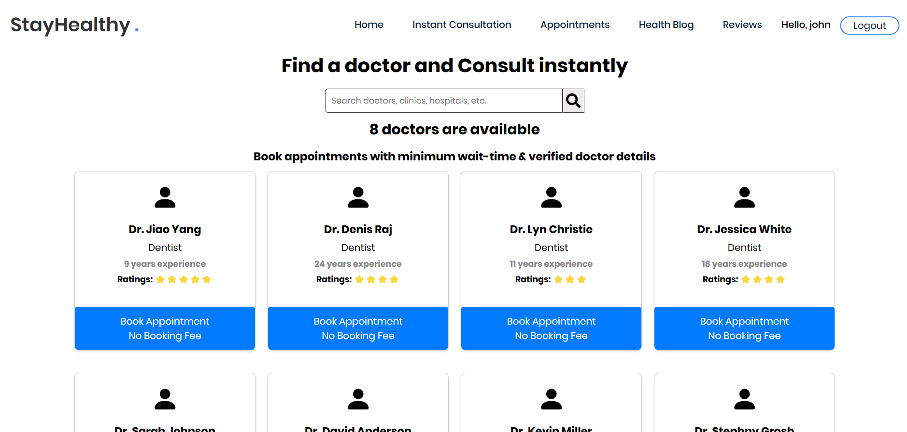 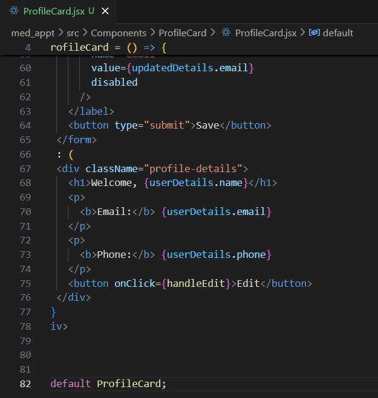 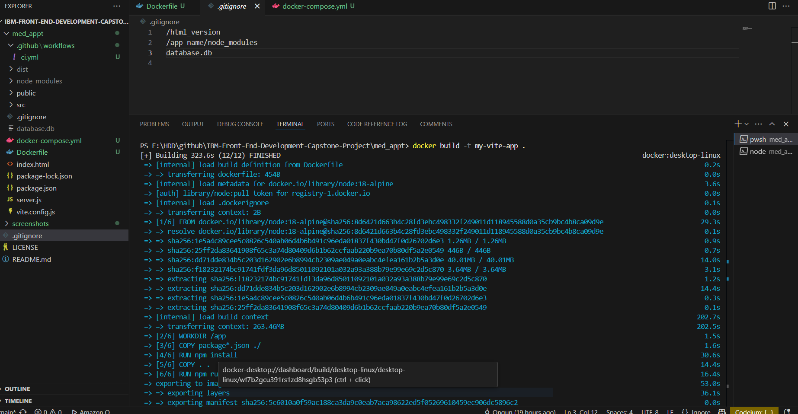     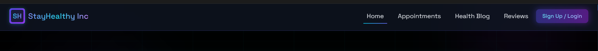  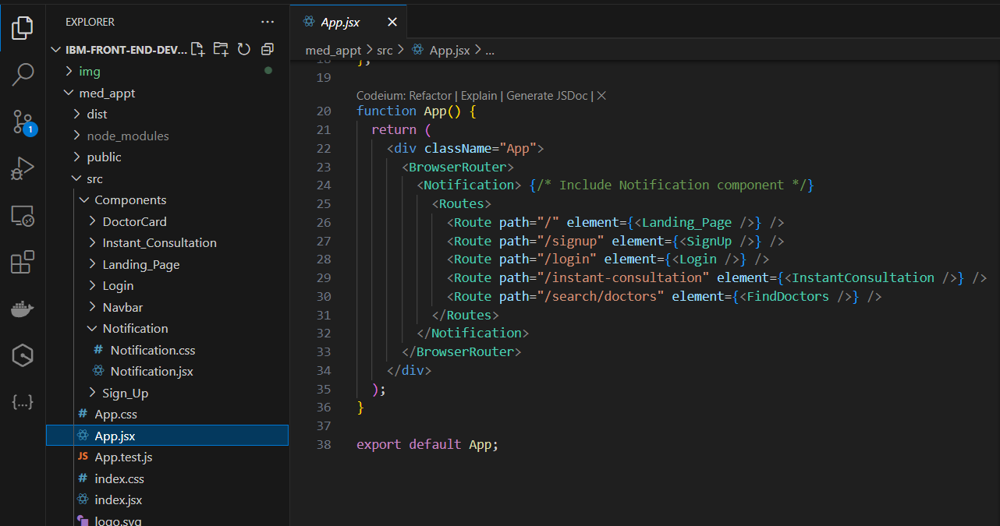 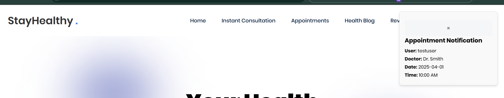     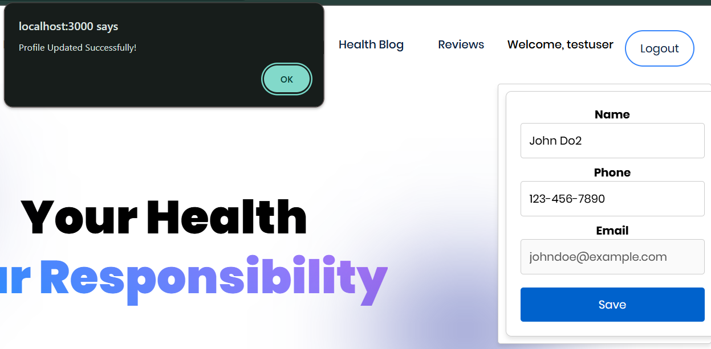   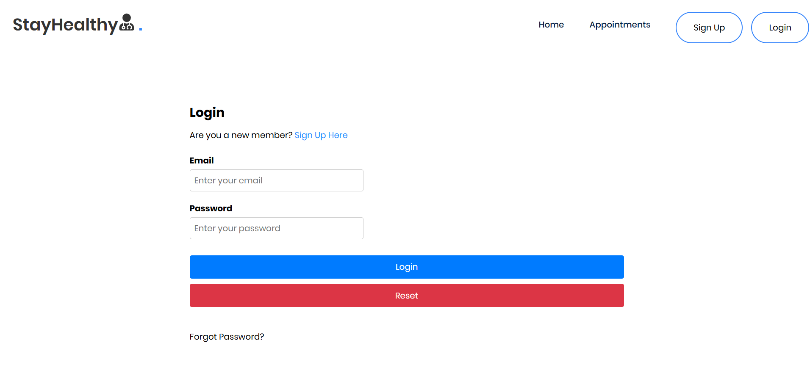    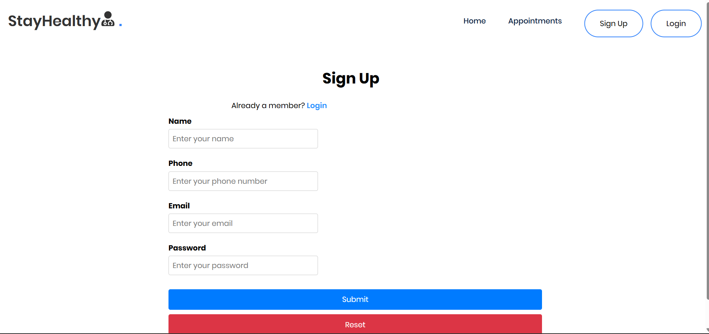    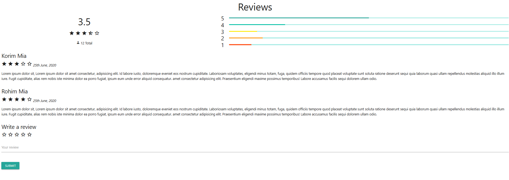 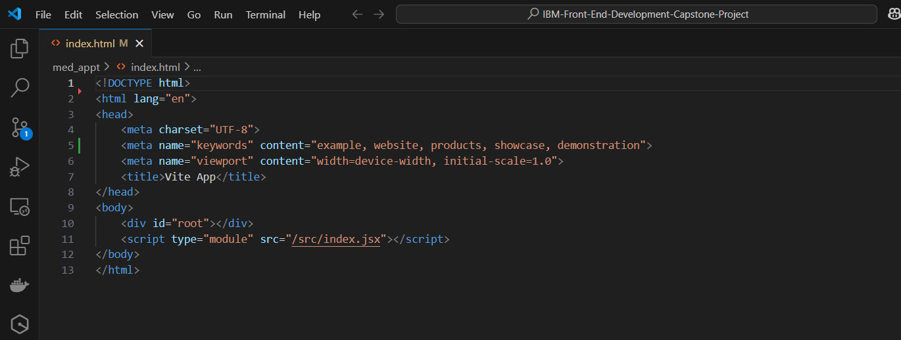   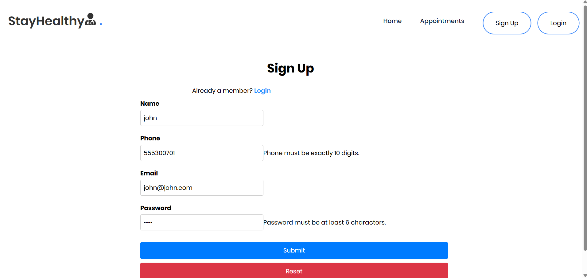  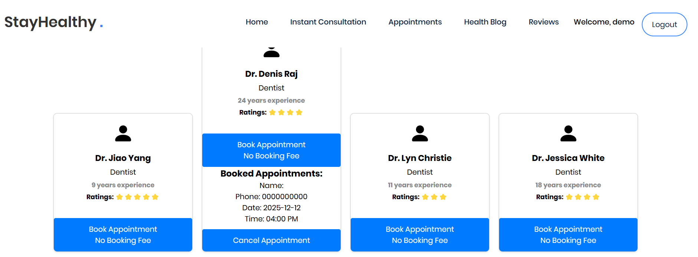